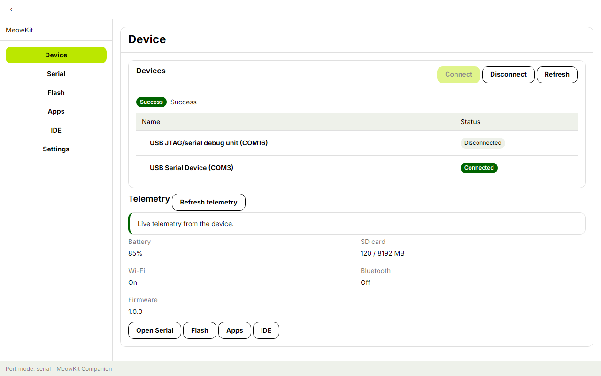
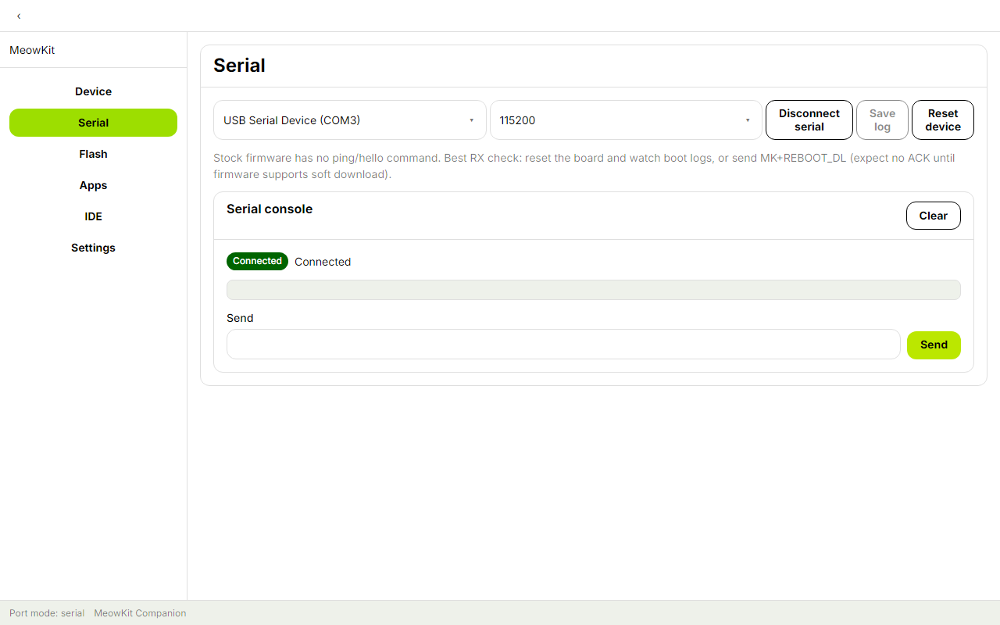
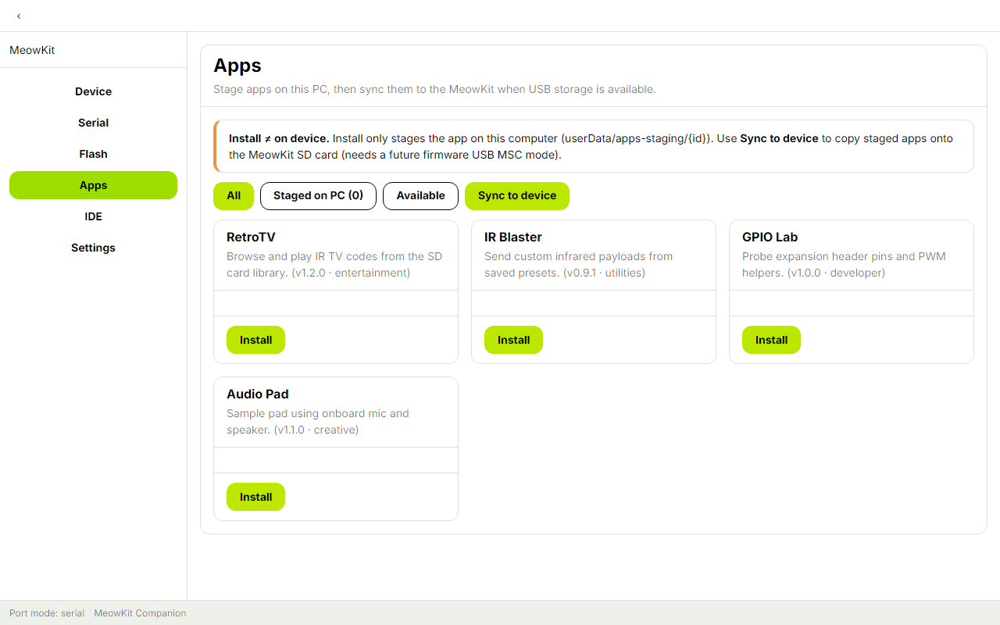
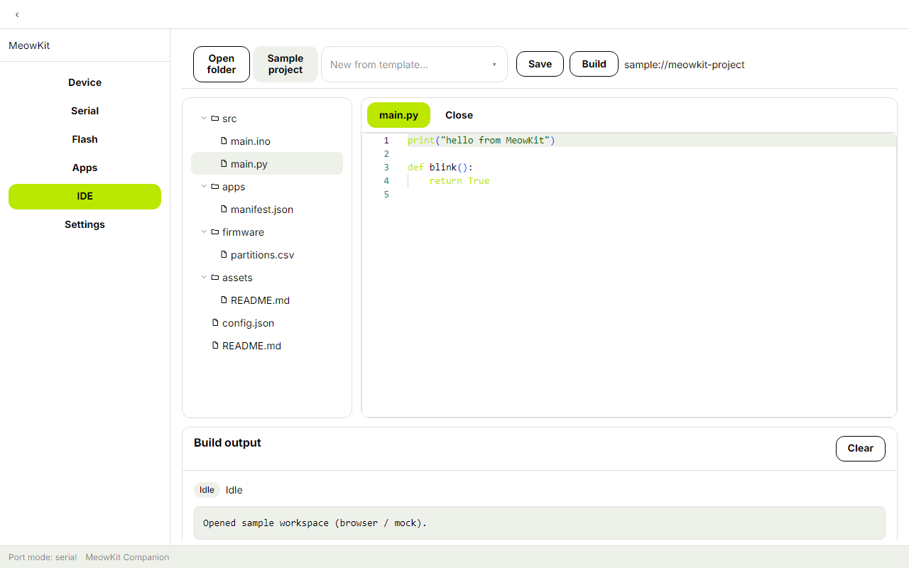

# MeowKit Companion

Offline Electron companion for [MeowKit](https://meowkit.cc/) ESP32-S3 devices — USB serial, firmware flash, app staging, and a MeowKit-themed IDE.

**v0.1.0** · Windows / macOS / Linux

## Screenshots

| Device | Serial |
| --- | --- |
|  |  |

| Apps | IDE |
| --- | --- |
|  |  |

## Prerequisites

- Node.js 20+
- pnpm 9 (`npx pnpm@9.15.0` on Windows if Corepack is unavailable)
- MeowKit + USB **data** cable for hardware features

## Quick start

```bash
git clone https://github.com/pve-homelab/MeowKit-Companion-Application.git
cd MeowKit-Companion-Application

git clone https://github.com/pve-homelab/MeowKit-React-Library.git vendor/MeowKit-React-Library

npx pnpm@9.15.0 install
npx pnpm@9.15.0 --filter @meowkit/components... build
npx pnpm@9.15.0 fetch-firmware

# UI preview (mock bridge, no USB)
npx pnpm@9.15.0 dev:web

# Electron (real serial / flash)
npx pnpm@9.15.0 dev
```

## Features (v0.1.0)

| Area | Behavior |
|------|----------|
| **Device** | Port list, connect @ 115200, telemetry when firmware supports `MK+STATUS?` |
| **Serial** | Console, baud select, save log, DTR reset, disconnect |
| **Flash** | Bundled factory image + custom `.bin` (hardware test deferred pending firmware soft-download) |
| **Apps** | Offline catalog; **Install** stages on PC; **Sync to device** when USB MSC is available |
| **IDE** | Monaco editor, open folder / sample / templates, build stub |
| **Settings** | Baud defaults, toolchain path, recent projects |

Serial and flash share one USB port (coordinator disconnects serial before flash).

## Soft-entry download mode (reserved)

| Item | Value |
|------|-------|
| Command | `MK+REBOOT_DL\n` |
| Success ACK | `MK+OK REBOOT_DL` |
| Stock firmware | Unsupported — Flash UI shows BOOT fallback |

## Scripts

| Script | Description |
|--------|-------------|
| `pnpm dev` | Electron + Vite |
| `pnpm dev:web` | Browser UI preview |
| `pnpm test` / `pnpm typecheck` | Unit tests / TypeScript |
| `pnpm fetch-firmware` | Bundle official factory image |
| `pnpm dist` | Windows installer (electron-builder) |

## Testing

```bash
npx pnpm@9.15.0 test
npx pnpm@9.15.0 typecheck
```

## References

| Resource | Link |
|----------|------|
| Design (B→C) | [`docs/superpowers/specs/2026-09-13-companion-b-c-design.md`](docs/superpowers/specs/2026-09-13-companion-b-c-design.md) |
| Product roadmap | [`docs/superpowers/specs/2026-09-13-companion-product-roadmap.md`](docs/superpowers/specs/2026-09-13-companion-product-roadmap.md) |
| MeowKit docs | [docs.meowkit.cc](https://docs.meowkit.cc/) |
| Official firmware | [mingolucky/meowkit-s3-firmware](https://github.com/mingolucky/meowkit-s3-firmware) |
| UI library (vendored) | [pve-homelab/MeowKit-React-Library](https://github.com/pve-homelab/MeowKit-React-Library) |
